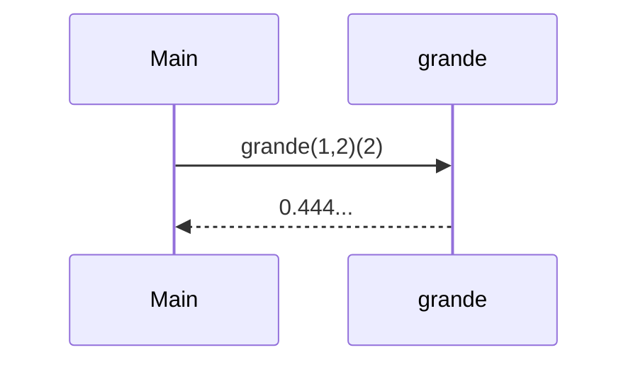
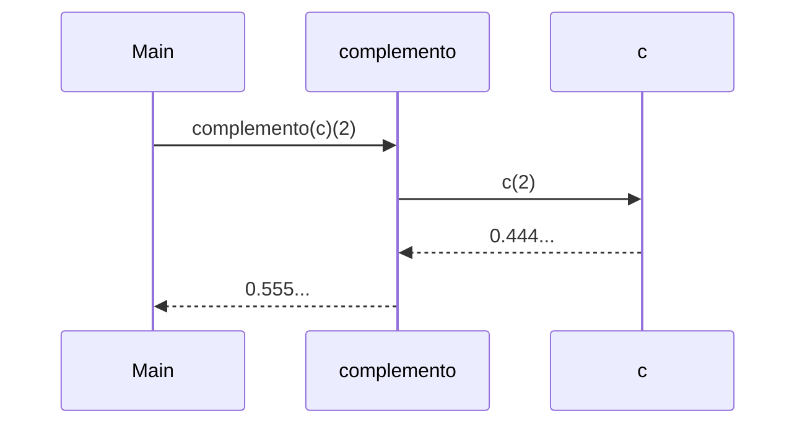
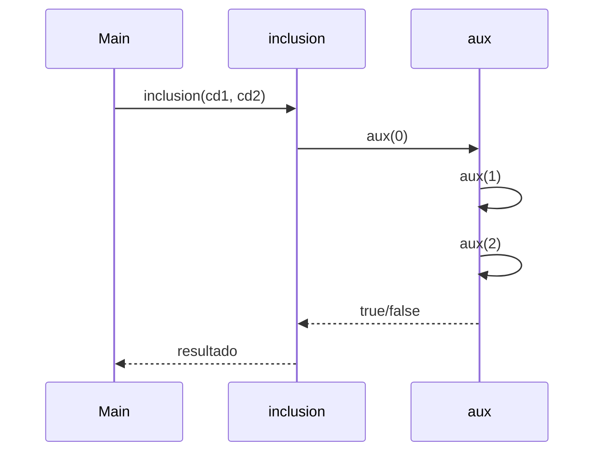
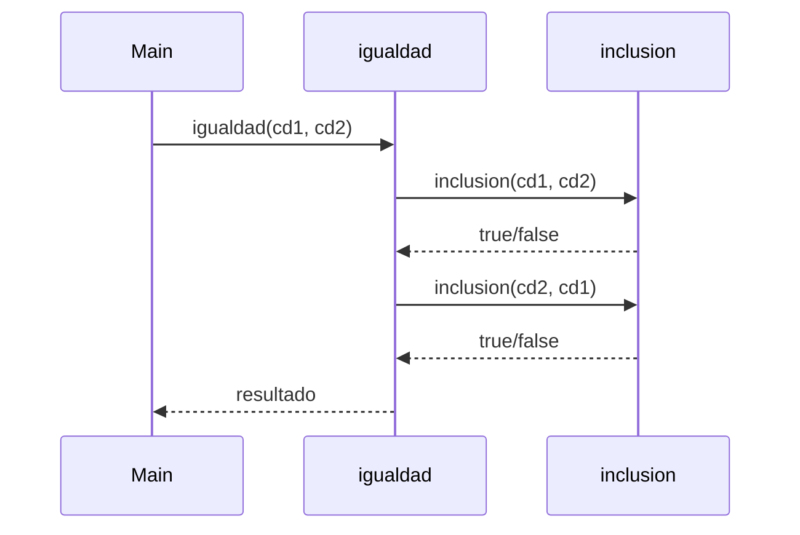
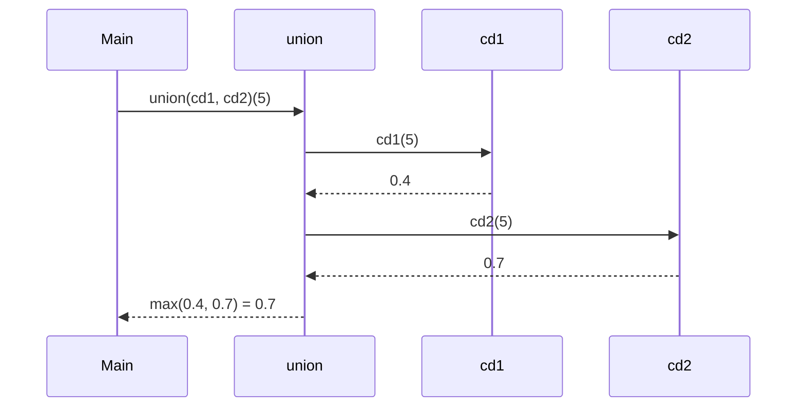
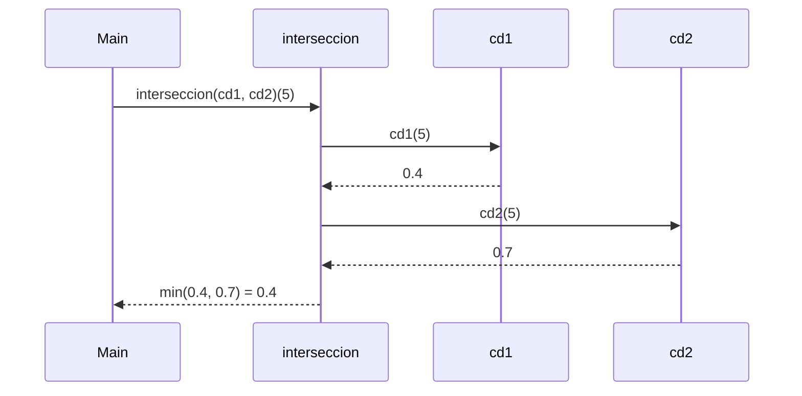

# Informe de Proceso

## Introducción
Los conjuntos difusos permiten modelar pertenencia parcial de un elemento a un conjunto, con valores en el intervalo [0,1].  
En este taller se implementaron distintas operaciones sobre conjuntos difusos en Scala: **grande, complemento, inclusión, igualdad, unión e intersección**.  
El objetivo fue aplicar conceptos de **programación funcional y recursión de cola**, representando los conjuntos como funciones `Int => Double`.

---

## Función `grande`

### Explicación
La función `grande(d,e)` define un conjunto difuso que modela la noción de "ser grande".  
Matemáticamente:

$$
f(x) =
\begin{cases}
0 & \text{si } x \leq 0 \\
\left(\frac{x}{x+d}\right)^e & \text{si } x > 0
\end{cases}
$$

En el código:
- Se asegura que `d ≥ 1` y `e ≥ 1`.
- Si `x ≤ 0`, el grado de pertenencia es `0.0`.
- En otro caso, se calcula `base = x/(x+d)` y se eleva a la potencia `e`.
- Finalmente se aplica un `clamp` para mantener el resultado en `[0,1]`.

### Ejemplo
Para `d=1, e=2` y `x=2`:  

$$f(2) = \left(\frac{2}{2+1}\right)^2 = \left(\frac{2}{3}\right)^2 = 0.444...$$


### Pila de llamados

## Función `complemento`

### Explicación
El complemento de un conjunto difuso `c` se define como:

$$
f_{\neg c}(x) = 1 - f_c(x)
$$

En el código:
- Se evalúa el conjunto original en `x` (`c(x)`).
- Se calcula `1.0 - v`.
- Se asegura que el valor esté en `[0,1]` usando un clamp.

### Ejemplo
Si `c(2) = 0.444...`, entonces:

$$
f_{\neg c}(2) = 1 - 0.444... = 0.555...
$$

### Pila de llamados

## Función `inclusión`

### Explicación
Un conjunto difuso `A` está incluido en `B` si para todo `x` se cumple:

$$
f_A(x) \leq f_B(x)
$$

En el código:
- Se implementa una función auxiliar recursiva `aux(i)` con **recursión de cola**.
- La función itera desde `i = 0` hasta `1000`, comparando los valores.
- Si en algún `i` ocurre que `cd1(i) > cd2(i)`, retorna `false`.
- Si se recorren todos los valores sin problema, retorna `true`.

### Ejemplo
Si para todos los `x` en el rango `0..1000` se cumple `cd1(x) <= cd2(x)`, entonces `inclusion(cd1, cd2)` es `true`.  
Por ejemplo:
- Si `cd1(5) = 0.4` y `cd2(5) = 0.6` → la condición se cumple.
- Si en algún `x` se diera que `cd1(x) > cd2(x)` → devuelve `false`.

### Pila de llamados

*(El proceso continúa de la misma forma hasta i = 1000…)*

## Función `igualdad`

### Explicación
Dos conjuntos difusos `A` y `B` son iguales si cada uno está incluido en el otro:

$$
A = B \iff (A \subseteq B) \wedge (B \subseteq A)
$$

En el código:
- Se reutiliza la función `inclusion`.
- Se devuelve `true` solo si `inclusion(cd1, cd2)` y `inclusion(cd2, cd1)` son ambas verdaderas.

### Ejemplo
Si `cd1(x) = cd2(x)` para todo `x`, entonces:
$$igualdad(cd1, cd2) = true$$

Si existe algún `x` donde difieran, la igualdad es `false`.

### Pila de llamados

## Función `unión`

### Explicación
La unión de dos conjuntos difusos `A` y `B` se define como:

$$
f_{A \cup B}(x) = \max(f_A(x), f_B(x))
$$

En el código:
- Se evalúan ambos conjuntos en el mismo `x`.
- Se retorna el máximo de los dos valores.

### Ejemplo
Si `cd1(5) = 0.4` y `cd2(5) = 0.7`, entonces:
$$f_{A \cup B}(5) = 0.7$$

### Pila de llamados

## Función `intersección`

### Explicación
La intersección de dos conjuntos difusos `A` y `B` se define como:

$$
f_{A \cap B}(x) = \min(f_A(x), f_B(x))
$$

En el código:
- Se evalúan ambos conjuntos en el mismo `x`.
- Se retorna el mínimo de los dos valores.

### Ejemplo
Si `cd1(5) = 0.4` y `cd2(5) = 0.7`, entonces:
$$f_{A \cap B}(5) = 0.4$$

### Pila de llamados


# Informe de Corrección

**Fundamentos de Programación Funcional y Concurrente**  
**Informe de corrección sobre las funciones implementadas en `ConjuntosDifusos`.**

---

## Función `grande(d, e)`

### Definición matemática

La función `grande(d, e)` construye un conjunto difuso de números enteros "grandes".  
Se define como:

$$
f(x) = \begin{cases}
0 & x \leq 0 \\
\left(\frac{x}{x+d}\right)^e & x > 0
\end{cases}
$$

Donde:
- $d \geq 1$ controla el desplazamiento.
- $e \geq 1$ controla la intensidad del crecimiento.

Además, se asegura que $f(x) \in [0,1]$.

### Código en Scala

```scala
def grande(d: Int, e: Int): ConjDifuso = {
  require(d >= 1, "d debe ser mayor o igual a 1")
  require(e >= 1, "e debe ser mayor o igual a 1")

  (x: Int) => {
    if (x <= 0) 0.0
    else {
      val base = x.toDouble / (x + d).toDouble
      val res = math.pow(base, e.toDouble)
      math.max(0.0, math.min(1.0, res))
    }
  }
}
```

### Argumentación de corrección

Queremos demostrar que:

$$
\forall x \in \mathbb{Z}^+ : P_{grande}(x) == f(x)
$$

- **Caso base**: $x \leq 0$  
  $$P_{grande}(x) = 0.0 \quad \land \quad f(x) = 0$$

- **Caso inductivo**: $x > 0$  
  $$P_{grande}(x) = \left(\frac{x}{x+d}\right)^e$$

Este valor siempre cumple $0 < P_{grande}(x) < 1$, y al aplicar `math.max` y `math.min`, se garantiza que el resultado esté en $[0,1]$.

**Conclusión:**  
$$\forall x \in \mathbb{Z} : P_{grande}(x) == f(x)$$

---

## Función `complemento(c)`

### Definición matemática

El complemento de un conjunto difuso $S$ está dado por:

$$
f_{\neg S}(x) = 1 - f_S(x)
$$

con la condición de mantener el rango en $[0,1]$.

### Código en Scala

```scala
def complemento(c: ConjDifuso): ConjDifuso = {
  (x: Int) => {
    val v = c(x)
    val res = 1.0 - v
    math.max(0.0, math.min(1.0, res))
  }
}
```

### Argumentación de corrección

Queremos demostrar que:

$$
\forall x \in \mathbb{Z} : P_{complemento}(x) == 1 - f(x)
$$

- Para cualquier $x$, si $c(x) \in [0,1]$, entonces $1 - c(x) \in [0,1]$.
- La instrucción `math.max(0.0, math.min(1.0, res))` garantiza que el resultado nunca salga de ese intervalo.

**Conclusión:**  
$$\forall x \in \mathbb{Z} : P_{complemento}(x) == f_{\neg S}(x)$$

---

## Función `union(cd1, cd2)`

### Definición matemática

La unión de dos conjuntos difusos $S_1$ y $S_2$ está definida como:

$$
f_{S_1 \cup S_2}(x) = \max(f_{S_1}(x), f_{S_2}(x))
$$

### Código en Scala

```scala
def union(cd1: ConjDifuso, cd2: ConjDifuso): ConjDifuso = {
  (x: Int) => Math.max(cd1(x), cd2(x))
}
```

### Argumentación de corrección

- Por definición de unión difusa, se toma el mayor grado de pertenencia de ambos conjuntos.
- `Math.max(cd1(x), cd2(x))` cumple exactamente esta propiedad.

**Conclusión:**  
$$\forall x \in \mathbb{Z} : P_{union}(x) == f_{S_1 \cup S_2}(x)$$

---

## Función `interseccion(cd1, cd2)`

### Definición matemática

La intersección de dos conjuntos difusos $S_1$ y $S_2$ está definida como:

$$
f_{S_1 \cap S_2}(x) = \min(f_{S_1}(x), f_{S_2}(x))
$$

### Código en Scala

```scala
def interseccion(cd1: ConjDifuso, cd2: ConjDifuso): ConjDifuso = {
  (x: Int) => Math.min(cd1(x), cd2(x))
}
```

### Argumentación de corrección

- Por definición de intersección difusa, se toma el menor grado de pertenencia de ambos conjuntos.
- `Math.min(cd1(x), cd2(x))` cumple esta propiedad directamente.

**Conclusión:**  
$$\forall x \in \mathbb{Z} : P_{interseccion}(x) == f_{S_1 \cap S_2}(x)$$

---

## Función `inclusion(cd1, cd2)`

### Definición matemática

Se dice que $S_1 \subseteq S_2$ si y sólo si:

$$
\forall x \in U : f_{S_1}(x) \leq f_{S_2}(x)
$$

En este taller se evalúa el universo en $[0, 1000]$.

### Código en Scala

```scala
def inclusion(cd1: ConjDifuso, cd2: ConjDifuso): Boolean = {
  @tailrec
  def aux(i: Int): Boolean = {
    if (i > 1000) true
    else if (cd1(i) <= cd2(i)) aux(i + 1)
    else false
  }
  aux(0)
}
```

### Argumentación de corrección

Queremos demostrar que:

$$
P_{inclusion}(cd1, cd2) = true \iff \forall x \in [0,1000] : cd1(x) \leq cd2(x)
$$

- **Caso base:** $i = 0$  
  Se evalúa $cd1(0) \leq cd2(0)$.  
  Si es cierto, continúa; si es falso, retorna `false`.

- **Caso inductivo:** $i = k+1$  
  La función hace una **llamada de cola**:  
  $$aux(k) = true \rightarrow aux(k+1)$$

- **Caso final:** $i > 1000$  
  En este punto, ya se han verificado todos los elementos, y se retorna `true`.

### Representación de la pila de llamadas

```mermaid
graph TD
  A0[aux(0)] --> A1[aux(1)]
  A1 --> A2[aux(2)]
  A2 --> DOTS[...]
  DOTS --> Af[aux(1000)]
  Af --> End[true]
```

**Conclusión:**  
$$\forall x \in [0,1000] : P_{inclusion}(cd1, cd2) == (cd1(x) \leq cd2(x))$$

---

## Función `igualdad(cd1, cd2)`

### Definición matemática

Dos conjuntos difusos son iguales si:

$$
S_1 = S_2 \iff (S_1 \subseteq S_2) \land (S_2 \subseteq S_1)
$$

### Código en Scala

```scala
def igualdad(cd1: ConjDifuso, cd2: ConjDifuso): Boolean = {
  inclusion(cd1, cd2) && inclusion(cd2, cd1)
}
```

### Argumentación de corrección

- La igualdad se define como inclusión mutua.
- El programa verifica ambas condiciones con `&&`.

**Conclusión:**  
$$\forall x \in [0,1000] : P_{igualdad}(cd1, cd2) == (cd1(x) == cd2(x))$$

---

# Conclusión informe corrección
Cada función implementada cumple exactamente con su **definición matemática**:

- `grande(d,e)` genera un conjunto difuso de números grandes.
- `complemento(c)` retorna el grado de pertenencia al complemento.
- `union` e `interseccion` siguen las definiciones clásicas extendidas a conjuntos difusos.
- `inclusion` utiliza recursión de cola para verificar la relación en $[0,1000]$.
- `igualdad` aplica inclusión mutua.

**Por lo tanto, todas las funciones son correctas respecto a su especificación.**