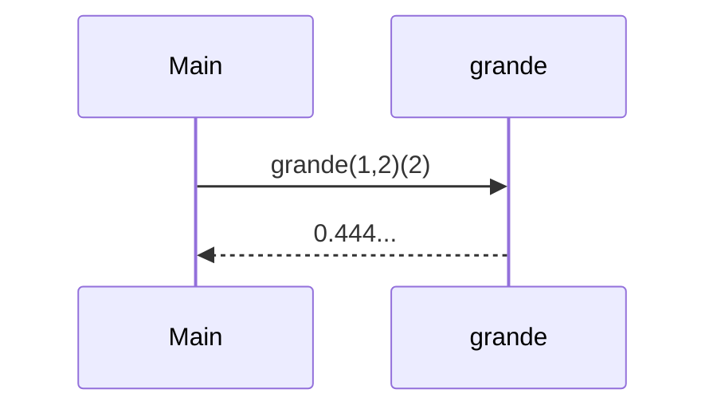
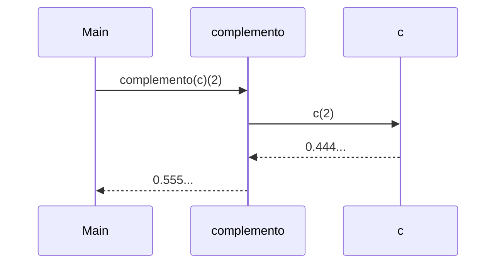
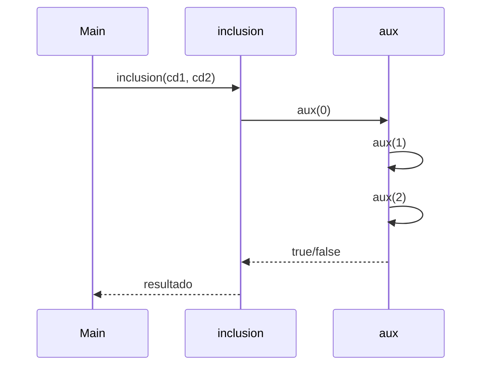
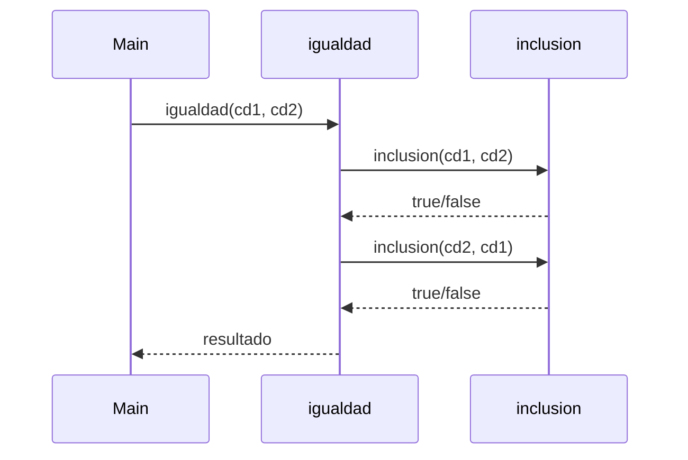
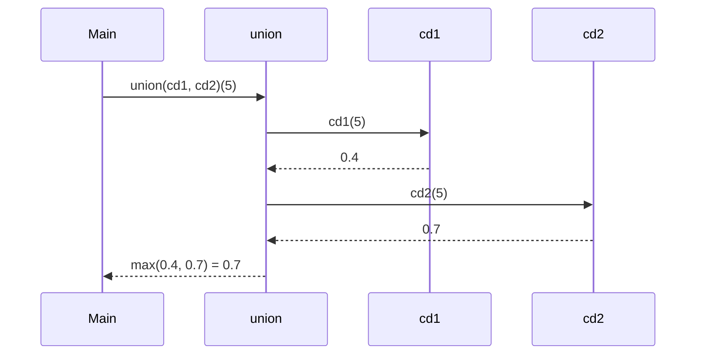
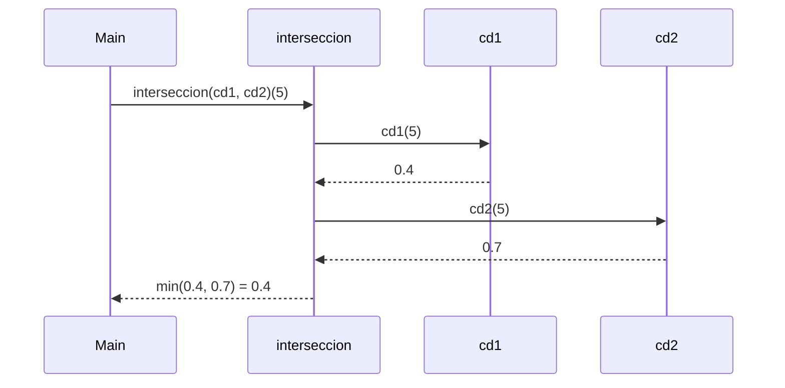

# Informe de Proceso

## 1. Introducción
Los conjuntos difusos permiten modelar pertenencia parcial de un elemento a un conjunto, con valores en el intervalo [0,1].  
En este taller se implementaron distintas operaciones sobre conjuntos difusos en Scala: **grande, complemento, inclusión, igualdad, unión e intersección**.  
El objetivo fue aplicar conceptos de **programación funcional y recursión de cola**, representando los conjuntos como funciones `Int => Double`.

---

## 2. Función `grande`

### 2.1 Explicación
La función `grande(d,e)` define un conjunto difuso que modela la noción de "ser grande".  
Matemáticamente:

$$
f(x) =
\begin{cases}
0 & \text{si } x \leq 0 \\
\left(\frac{x}{x+d}\right)^e & \text{si } x > 0
\end{cases}
$$

En el código:
- Se asegura que `d ≥ 1` y `e ≥ 1`.
- Si `x ≤ 0`, el grado de pertenencia es `0.0`.
- En otro caso, se calcula `base = x/(x+d)` y se eleva a la potencia `e`.
- Finalmente se aplica un `clamp` para mantener el resultado en `[0,1]`.

### 2.2 Ejemplo
Para `d=1, e=2` y `x=2`:  

$$f(2) = \left(\frac{2}{2+1}\right)^2 = \left(\frac{2}{3}\right)^2 = 0.444...$$


### 2.3 Pila de llamados

## 3. Función `complemento`

### 3.1 Explicación
El complemento de un conjunto difuso `c` se define como:

$$
f_{\neg c}(x) = 1 - f_c(x)
$$

En el código:
- Se evalúa el conjunto original en `x` (`c(x)`).
- Se calcula `1.0 - v`.
- Se asegura que el valor esté en `[0,1]` usando un clamp.

### 3.2 Ejemplo
Si `c(2) = 0.444...`, entonces:

$$
f_{\neg c}(2) = 1 - 0.444... = 0.555...
$$

### 3.3 Pila de llamados

## 4. Función `inclusión`

### 4.1 Explicación
Un conjunto difuso `A` está incluido en `B` si para todo `x` se cumple:

$$
f_A(x) \leq f_B(x)
$$

En el código:
- Se implementa una función auxiliar recursiva `aux(i)` con **recursión de cola**.
- La función itera desde `i = 0` hasta `1000`, comparando los valores.
- Si en algún `i` ocurre que `cd1(i) > cd2(i)`, retorna `false`.
- Si se recorren todos los valores sin problema, retorna `true`.

### 4.2 Ejemplo
Si para todos los `x` en el rango `0..1000` se cumple `cd1(x) <= cd2(x)`, entonces `inclusion(cd1, cd2)` es `true`.  
Por ejemplo:
- Si `cd1(5) = 0.4` y `cd2(5) = 0.6` → la condición se cumple.
- Si en algún `x` se diera que `cd1(x) > cd2(x)` → devuelve `false`.

### 4.3 Pila de llamados

*(El proceso continúa de la misma forma hasta i = 1000…)*

## 5. Función `igualdad`

### 5.1 Explicación
Dos conjuntos difusos `A` y `B` son iguales si cada uno está incluido en el otro:

$$
A = B \iff (A \subseteq B) \wedge (B \subseteq A)
$$

En el código:
- Se reutiliza la función `inclusion`.
- Se devuelve `true` solo si `inclusion(cd1, cd2)` y `inclusion(cd2, cd1)` son ambas verdaderas.

### 5.2 Ejemplo
Si `cd1(x) = cd2(x)` para todo `x`, entonces:
$$igualdad(cd1, cd2) = true$$

Si existe algún `x` donde difieran, la igualdad es `false`.

### 5.3 Pila de llamados

## 6. Función `unión`

### 6.1 Explicación
La unión de dos conjuntos difusos `A` y `B` se define como:

$$
f_{A \cup B}(x) = \max(f_A(x), f_B(x))
$$

En el código:
- Se evalúan ambos conjuntos en el mismo `x`.
- Se retorna el máximo de los dos valores.

### 6.2 Ejemplo
Si `cd1(5) = 0.4` y `cd2(5) = 0.7`, entonces:
$$f_{A \cup B}(5) = 0.7$$

### 6.3 Pila de llamados

## 7. Función `intersección`

### 7.1 Explicación
La intersección de dos conjuntos difusos `A` y `B` se define como:

$$
f_{A \cap B}(x) = \min(f_A(x), f_B(x))
$$

En el código:
- Se evalúan ambos conjuntos en el mismo `x`.
- Se retorna el mínimo de los dos valores.

### 7.2 Ejemplo
Si `cd1(5) = 0.4` y `cd2(5) = 0.7`, entonces:
$$f_{A \cap B}(5) = 0.4$$

### 7.3 Pila de llamados

# Informe de Corrección

**Fundamentos de Programación Funcional y Concurrente**  
**Informe de corrección sobre las funciones implementadas en `ConjuntosDifusos`.**


## Función `grande(d, e)`

### Definición matemática (texto compatible GitHub)

La función `grande(d, e)` construye un conjunto difuso de números enteros "grandes". Se puede expresar así:

```
f(x) =
  0               if x <= 0
  (x / (x + d))^e if x > 0
```

Donde:
- `d >= 1` controla el desplazamiento.
- `e >= 1` controla la intensidad del crecimiento.

Además, se asegura que `f(x)` pertenezca al intervalo `[0, 1]`.

### Código en Scala

```scala
def grande(d: Int, e: Int): ConjDifuso = {
  require(d >= 1, "d debe ser mayor o igual a 1")
  require(e >= 1, "e debe ser mayor o igual a 1")

  (x: Int) => {
    if (x <= 0) 0.0
    else {
      val base = x.toDouble / (x + d).toDouble
      val res = math.pow(base, e.toDouble)
      math.max(0.0, math.min(1.0, res))
    }
  }
}
```

### Argumentación de corrección (forma legible en GitHub)

Queremos demostrar que:
- `∀ x ∈ ℤ⁺ : P_grande(x) = f(x)`

- **Caso base**: `x ≤ 0`  
  `P_grande(x) = 0.0` y `f(x) = 0`. Por tanto coinciden.

- **Caso inductivo**: `x > 0`  
  `P_grande(x) = (x / (x + d))^e`. Este valor satisface `0 < P_grande(x) < 1` para `d >= 1, e >= 1`. Además, el uso de `math.max` y `math.min` garantiza que el valor final se mantenga en `[0,1]`.

**Conclusión:** para todos los enteros `x`, `P_grande(x)` cumple la especificación `f(x)`.

---

## Función `complemento(c)`

### Definición matemática (texto)

El complemento de un conjunto difuso `S` se define por:
```
f_notS(x) = 1 - f_S(x)
```
y debe permanecer en `[0,1]`.

### Código en Scala

```scala
def complemento(c: ConjDifuso): ConjDifuso = {
  (x: Int) => {
    val v = c(x)
    val res = 1.0 - v
    math.max(0.0, math.min(1.0, res))
  }
}
```

### Argumentación de corrección

- Para cualquier `x`, si `c(x) ∈ [0,1]` entonces `1 - c(x) ∈ [0,1]`.
- La llamada a `math.max(0.0, math.min(1.0, res))` evita salidas del intervalo por redondeos o valores fuera de rango.

**Conclusión:** `P_complemento(x) = 1 - f(x)` para todo `x` (representado en el dominio entero considerado).

---

## Función `union(cd1, cd2)`

### Definición matemática (texto)

La unión difusa de `S1` y `S2` es:
```
f_{S1 ∪ S2}(x) = max( f_{S1}(x), f_{S2}(x) )
```

### Código en Scala

```scala
def union(cd1: ConjDifuso, cd2: ConjDifuso): ConjDifuso = {
  (x: Int) => Math.max(cd1(x), cd2(x))
}
```

### Argumentación de corrección

`Math.max(cd1(x), cd2(x))` devuelve exactamente el mayor grado de pertenencia entre los dos conjuntos, que es la definición de unión difusa.

**Conclusión:** para todo `x`, `P_union(x) = f_{S1 ∪ S2}(x)`.

---

## Función `interseccion(cd1, cd2)`

### Definición matemática (texto)

La intersección difusa de `S1` y `S2` es:
```
f_{S1 ∩ S2}(x) = min( f_{S1}(x), f_{S2}(x) )
```

### Código en Scala

```scala
def interseccion(cd1: ConjDifuso, cd2: ConjDifuso): ConjDifuso = {
  (x: Int) => Math.min(cd1(x), cd2(x))
}
```

### Argumentación de corrección

`Math.min(cd1(x), cd2(x))` devuelve exactamente el menor grado de pertenencia entre los dos conjuntos, que es la definición de intersección difusa.

**Conclusión:** para todo `x`, `P_interseccion(x) = f_{S1 ∩ S2}(x)`.

---

## Función `inclusion(cd1, cd2)`

### Definición matemática (texto)

Se dice que `S1 ⊆ S2` si y sólo si:
```
forall x in U : f_{S1}(x) <= f_{S2}(x)
```

En este taller se toma `U = [0, 1000]` (enteros de 0 a 1000).

### Código en Scala

```scala
def inclusion(cd1: ConjDifuso, cd2: ConjDifuso): Boolean = {
  @tailrec
  def aux(i: Int): Boolean = {
    if (i > 1000) true
    else if (cd1(i) <= cd2(i)) aux(i + 1)
    else false
  }
  aux(0)
}
```

### Argumentación de corrección

Queremos demostrar que:
```
P_inclusion(cd1, cd2) = true  <=>  forall x in [0,1000] : cd1(x) <= cd2(x)
```

- **Caso base (i = 0):** se evalúa `cd1(0) <= cd2(0)`. Si es falso, la función retorna `false`. Si es verdadero, continua.
- **Paso inductivo (i = k+1):** si `aux(k)` ha comprobado `cd1(0..k) <= cd2(0..k)` y `cd1(k+1) <= cd2(k+1)` entonces `aux(k+1)` es verdadero; la llamada es de cola.
- **Caso final:** si `i > 1000` se retorna `true` (se comprobó todo el rango).

### Representación de la pila de llamadas (Mermaid)

> Nota: GitHub renderiza Mermaid si el bloque está correctamente formateado. Aquí se usa la sintaxis recomendada `flowchart`.

```mermaid
flowchart TD
  A0[aux(0)] --> A1[aux(1)]
  A1 --> A2[aux(2)]
  A2 --> A3[...]
  A3 --> Af[aux(1000)]
  Af --> End[true]
```

**Conclusión:** para todo `x` en `[0,1000]`, `P_inclusion(cd1, cd2)` devuelve `true` exactamente cuando `cd1(x) <= cd2(x)`.

---

## Función `igualdad(cd1, cd2)`

### Definición matemática (texto)

Dos conjuntos difusos son iguales si:
```
S1 = S2 <=> (S1 ⊆ S2) and (S2 ⊆ S1)
```

### Código en Scala

```scala
def igualdad(cd1: ConjDifuso, cd2: ConjDifuso): Boolean = {
  inclusion(cd1, cd2) && inclusion(cd2, cd1)
}
```

### Argumentación de corrección

- La igualdad se reduce a comprobar inclusión mutua. El operador `&&` garantiza que ambas condiciones sean verdaderas.

**Conclusión:** para todo `x` en `[0,1000]`, `P_igualdad(cd1, cd2)` es verdadero si y solo si `cd1(x) == cd2(x)`.

---

# Conclusión general

Todas las funciones implementadas en `ConjuntosDifusos` satisfacen su especificación matemática.  
Se han adaptado las expresiones para que se muestren correctamente en la vista de GitHub (sin LaTeX crudo).

Si quieres, puedo además:
- Generar imágenes PNG para las ecuaciones y sustituir los bloques de texto por imágenes (opción visual).
- Añadir ejemplos de casos de prueba (5 por función) en un archivo `tests/` o en `README.md`.
- Preparar el commit y PR sugeridos.

